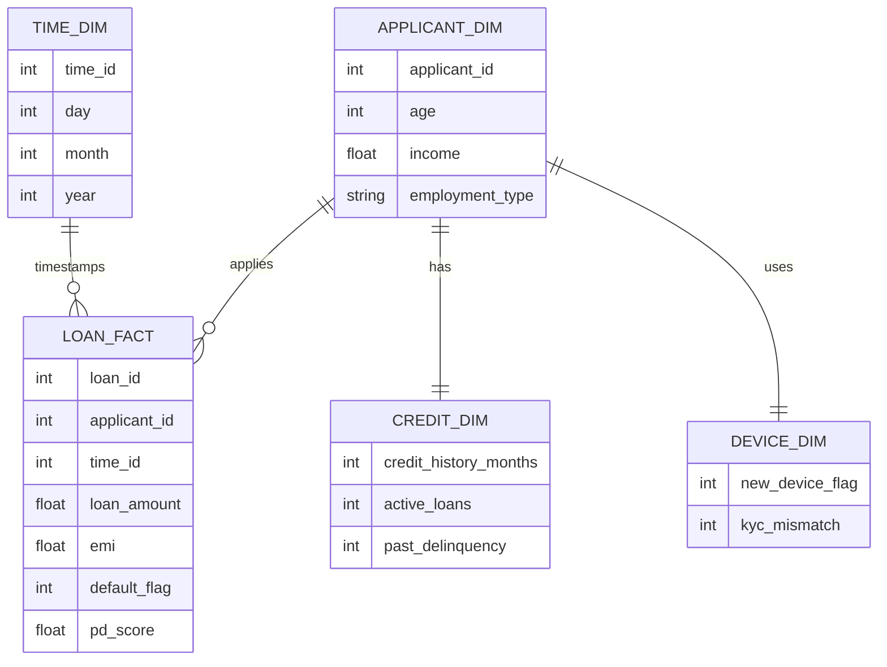
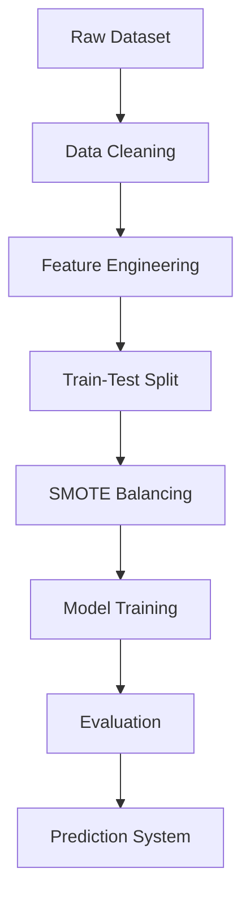

# Finova — AI-Driven Credit Risk Engine

Finova is an end-to-end data warehousing and machine learning system designed to simulate a real-world digital lending platform.  
It predicts the Probability of Default (PD), assigns risk categories, and supports lending decisions with explainability and analytics.

---

## Project Overview

This project replicates a production-style fintech underwriting system used by:

- NBFCs  
- Buy Now Pay Later (BNPL) platforms  
- Digital lending applications  

The system integrates data engineering, machine learning, and visualization to enable intelligent credit decisions.

---

## Key Features

- Synthetic dataset generation (25,000+ records)
- Data warehouse design using star schema
- Feature engineering for financial risk indicators
- Machine learning models:
  - Logistic Regression (baseline)
  - XGBoost (advanced)
- Class imbalance handling using SMOTE
- Evaluation metrics:
  - PR-AUC
  - Recall
  - KS Statistic
- SHAP-based explainability
- Risk banding and decision engine
- Interactive Streamlit dashboard
- Real-time simulation

---

## System Architecture

```mermaid
flowchart TD
    A[Loan Application Input] --> B[Data Preprocessing]
    B --> C[Feature Engineering]
    C --> D[Model Prediction]
    D --> E[Probability of Default (PD)]
    E --> F[Risk Banding]
    F --> G[Decision Engine]
    G --> H[Approve]
    G --> I[Manual Review]
    G --> J[Reject]
    D --> K[SHAP Explainability]
```

---

## Data Warehouse Design



---

## Machine Learning Pipeline



---

## Risk Banding Logic

| PD Range | Risk Level | Decision |
|----------|-----------|----------|
| < 0.30   | Low       | Approve |
| 0.30–0.60| Medium    | Manual Review |
| > 0.60   | High      | Reject |

---

## Explainability

The system uses SHAP (Shapley Additive Explanations) to:

- Identify key drivers of credit risk  
- Provide global feature importance  
- Explain individual predictions  

---

## Project Structure

```
finova-credit-risk-engine/
│── data/
│── src/
│   ├── data_preprocessing.py
│   ├── feature_engineering.py
│   ├── model_training.py
│   ├── evaluation.py
│   ├── woe_iv.py
│   ├── risk_banding.py
│   ├── explainability.py
│
│── reports/
│── diagrams/
│── sql/
│── main.py
│── dashboard.py
│── generate_dataset.py
│── requirements.txt
│── README.md
```

---

## Setup Instructions

### Install dependencies

```
pip install -r requirements.txt
```

### Generate dataset

```
python generate_dataset.py
```

### Train model

```
python main.py
```

### Run dashboard

```
python -m streamlit run dashboard.py
```

---

## Dashboard Features

- Loan application simulation  
- Probability of default prediction  
- Risk classification and decision  
- SHAP explainability  
- Interactive charts  

---

## Key Learnings

- Credit risk modeling in fintech systems  
- Handling imbalanced datasets  
- Importance of explainability in finance  
- Data warehousing for analytics  
- End-to-end ML pipeline design  

---

## Future Enhancements

- API-based real-time inference  
- Authentication and role-based access  
- Cloud deployment  
- Integration with real financial datasets  
- Advanced monitoring and drift detection  

---

## Author

Kunal Kumar Dappu  
B.Tech Computer Science Engineering
